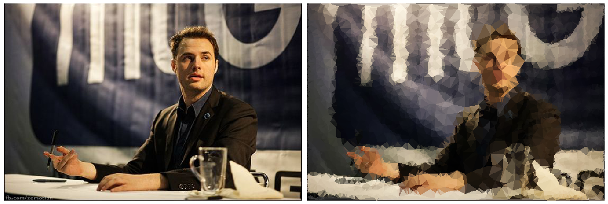

# mesh-based-image-average
Create a mesh over an image based on gradients and modify the image based on that. 

Made during the DK30 for my generative art project.

Example result:

Usage: modify and run gen_mesh.py